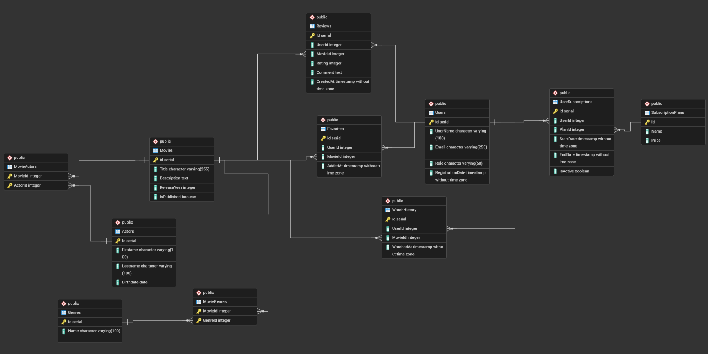

  <h1>Streaming Platform</h1>

## Огляд
Платформа надає доступ до медіаконтенту за моделлю підписки з чітким розмежуванням ролей між глядачами та адміністраторами. Тарифні плани мають контроль терміну дії, а доступ до функцій визначається станом підписки.
Присутній розширений пошук за жанром, роком, рейтингом та іншими фільтрами. Глядачі можуть зберігати улюблені фільми, переглядати історію та залишати відгуки, тоді як адміністратори керують контентом, модерацією та аналітикою.

## Ролі та права
| Роль | Можливості |
| --- | --- |
| Глядач | Перегляд каталогу, пошук, обране, історія, оцінки, оформлення/продовження підписки |
| Адміністратор | Управління жанрами та акторами, модерація відгуків, керування користувачами й тарифами, перегляд метрик |

## Архітектура даних
- Реляційна модель з ключовими зв’язками типу «багато-до-багатьох» для жанрів і акторських складів.
- Зберігання термінів дії підписки в БД для автоматичного контролю доступу.
## Діаграми
- Use-case: 
- ERD: 
- ERD PostgreSQL: 

## Стек та сервіси
- База даних: PostgreSQL 
